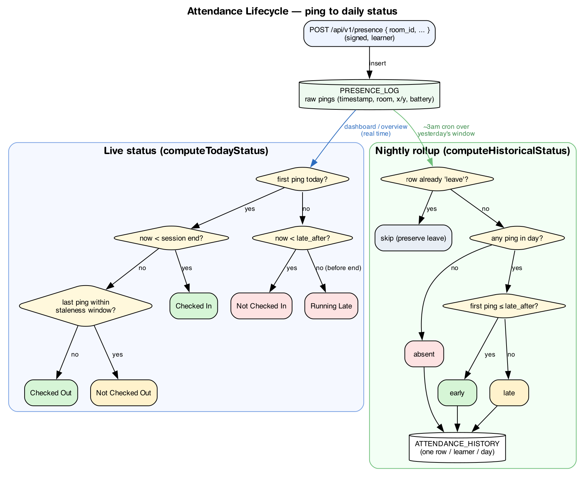

# Aegis — Architecture

The technical reference for how Aegis is built: subsystems, data model, auth,
the attendance lifecycle, and device signing. For the product framing see the
[Product Overview](product-overview.md) and [PRD](product-requirements.md).

---

## System overview

Aegis is four subsystems around one backend and one database:

| Subsystem | Dir | Responsibility |
|---|---|---|
| Backend | `Aegis-Backend` | REST API, auth, presence ingestion, attendance rollup, config. The single source of truth. |
| Learner app | `Aegis` | iOS/SwiftUI. Auth, dashboard, history, device binding + request signing; (planned) beacon detection → presence. |
| Admin app | `Aegis-Admin` | macOS/SwiftUI. Live radar, roster, and CRUD for rooms/beacons/users; config; reports. |
| Beacon | `Aegis-Beacon` | ESP32 iBeacon advertiser (rotating minor). |

All clients talk to the backend over HTTP (`/api/v1`, plus `/auth`). There is no
direct client-to-client or client-to-DB communication.

---

## Backend

**Stack:** Node.js 20 (ESM) · TypeScript · Express 4 · MySQL 8 (via `mysql2`
pool) · zod (validation) · pino (logging) · Vitest (tests).

**Boot:** `src/server.ts` → `buildApp()` in `src/app.ts` (sets `trust proxy`,
`express.json` with a raw-body capture hook for signing, mounts routers, then a
central `errorHandler`). Config is validated at startup in `src/lib/config.ts`
(requires `DB_*` and a ≥32-char `JWT_SECRET`).

**Layering:** `routes/` (HTTP + zod validation) → `services/` (domain logic) →
`db/queries/` (parameterized SQL) → `db/pool.ts`. Errors are thrown as
`AppError(code)` and mapped to HTTP status by the error handler.

### Auth model

- **Access token** — JWT HS256, 15-min TTL, claims `sub` / `role` / `session`
  (`services/tokenService.ts`), verified by `middleware/requireAuth.ts`.
- **Refresh token** — 32 random bytes, 30-day TTL, stored **hashed** (SHA-256)
  in `REFRESH_TOKEN`. Rotation is transactional with `SELECT … FOR UPDATE`;
  reuse of an already-revoked token revokes the entire chain
  (`services/authService.ts`).
- **Passwords** — bcrypt cost 12 (`services/passwordService.ts`), capped at 72
  bytes.
- **Authorization** — `middleware/requireRole.ts` gates learner vs admin.
- **Device signature** — `middleware/requireSignature.ts` on `POST /presence`
  (see [Device signing](#device-signing)).

### API surface

Full request/response detail is in [`api-reference.html`](api-reference.html)
and the [Postman collection](aegis.postman_collection.json). Summary:

- **`/auth`** (no JWT): `login`, `refresh`, `logout`. Rate-limited.
- **Learner** (`requireAuth` + `requireRole('learner')`): `GET /me`,
  `GET /dashboard`, `GET /histories`, `POST /presence` (**+ `requireSignature`**
  + per-user rate limit), `POST /register-device`, `GET /beacons` (auth only).
- **Admin** (`requireAuth` + `requireRole('admin')`): `absence-summary`,
  `overview`, rooms CRUD + `map` / `current-occupants` / `additional-data`,
  beacons CRUD, users CRUD + password reset + reactivate, `session-config`,
  `system-config`, `rollup`.

---

## Data model

MySQL 8, managed by numbered SQL migrations in `Aegis-Backend/migrations/`
(applied by `scripts/migrate.ts`, tracked in `SCHEMA_MIGRATIONS`).

| Table | Key columns | Notes |
|---|---|---|
| `USER` | `id_user` PK, `username` uniq, `password` (bcrypt), `email` uniq, `role` (admin/learner), `session` (AM/PM), `is_active`, `device_public_key` VARCHAR(256) | The device key (raw X9.63, base64) is set by `register-device`. |
| `ROOM` | `id_room` PK, `name` | |
| `DEVICE` | `id_device` PK, `name`, `identifier` uniq, `id_room` FK→ROOM (nullable) | The iBeacons; unassigned when `id_room` NULL. |
| `PRESENCE_LOG` | `id_log` PK, `id_user` FK, `id_room` FK, `timestamp`, `position_x/y`, `battery_level` | Raw pings; both FKs cascade. |
| `ATTENDANCE_HISTORY` | PK (`id_user`, `date`), `status` (early/late/absent/leave) | One row per learner per day; produced by rollup. |
| `REFRESH_TOKEN` | `id_token` PK, `id_user` FK, `token_hash` uniq, `expires_at`, `revoked_at`, `replaced_by_id` | Rotation chain + reuse detection. |
| `SESSION_CONFIG` | `session` PK (AM/PM), `start_time`, `late_after`, `end_time` | Seeded AM 08:00/08:15/12:00, PM 13:00/13:15/17:00. |
| `SYSTEM_CONFIG` | `key` PK, `value` | Seeded `presence_staleness_minutes=5`, `timezone=Asia/Jakarta`. |

---

## Attendance lifecycle

A presence ping becomes a daily attendance record in two stages:

**Live status** (`services/statusService.ts` → `computeTodayStatus`, used by the
dashboard and admin overview): derived in real time from today's pings against
the session window (in the configured timezone) and the staleness threshold —
`Not Checked In` / `Running Late` / `Checked In` / `Checked Out` /
`Not Checked Out` / `Off` (leave).

**Nightly rollup** (`services/rollupService.ts` → `runRollup`, via
`scripts/rollupAttendance.ts` on a ~3am cron or the admin `rollup` endpoint):
for each learner, over the previous day's window — an existing `leave` row is
preserved; otherwise no ping → `absent`, first ping ≤ `late_after` → `early`,
else → `late`. Idempotent and DST-safe (`yesterdayInTz`). Config is cached ~30 s
and invalidated on admin update (`services/configService.ts`).

---

## Device signing

`POST /api/v1/presence` carries a P-256 ECDSA signature in addition to the JWT,
binding each report to the registered physical device. Full detail:
[end-to-end explainer](device-signing-end-to-end.md), [protocol](device-signing.md),
[iOS guide](device-signing-ios.md).

- **Register once:** the phone generates a Secure Enclave key, exports the raw
  X9.63 public point (base64), and `POST /register-device` stores it on `USER`.
- **Sign every request:** client signs
  `METHOD\nPATH\nUNIX_TS\nSHA256_HEX(body)` and sends `X-Timestamp` +
  `X-Signature`.
- **Verify:** `requireSignature` rebuilds the string (path from
  `req.originalUrl`, body hash from the captured raw body), wraps the stored raw
  point into SPKI DER (`lib/deviceKey.ts` `x963ToSpkiDer`), and verifies with
  `crypto.createVerify`. Missing/old timestamp → 400; missing key or bad/forged
  signature → 403.

---

## Clients

### Learner app (`Aegis`, iOS/SwiftUI)

- **Structure:** `Views/` + `ViewModels/` (per screen `ObservableObject`),
  `Services/` (`HttpService` base + `ApiService` endpoints, `CryptoManager`,
  `DataStore` global state), `Models/`, `AppConfig/` (`AppEnvironment` resolves
  the base URL from `AEGIS_BASE_URL` env → Info.plist → compiled default).
- **Networking:** one generic `HttpService.request` handles auth header,
  token-refresh-on-401 with one retry, and — for protected routes — attaches
  the signature headers via `CryptoManager.signRequest`.
- **Built:** login, dashboard, attendance history, device key generation +
  registration, request signing, `sendPresence(...)` capability.
- **Planned:** CoreLocation/iBeacon detection and the trigger that calls
  `sendPresence` (see the [roadmap](product-overview.md#roadmap--next-steps)).

### Admin app (`Aegis-Admin`, macOS/SwiftUI)

`AegisAPIClient` wraps the admin API; `AdministrationViews` provides the roster,
room/beacon/user tables and form sheets, live radar (room map + occupants +
metrics), session/system config, and a reports/rollup view. State in
`SessionStore` + view models.

### Beacon (`Aegis-Beacon`, ESP32)

`ibeacon.ino` uses NimBLE to advertise a standard 25-byte iBeacon payload
(fixed UUID + major, placeholder minor), rotating the **minor** every 5 minutes
to resist trivial beacon replication. CoreLocation requires a shared UUID across
a room's beacons, so identity rotation is done via minor rather than UUID.

---

## Cross-cutting

- **Validation:** every route parses input with zod; failures → `invalid_request`
  (400).
- **Rate limiting:** `/auth/*` (60/15min per ip:username) and `POST /presence`
  (20/60s per user).
- **Testing:** Vitest, 24 test files across lib/middleware/routes/services,
  including the device-signing edge cases and a cross-language signing vector.
- **Ops gaps (planned):** no CI workflow and no container/compose file yet; see
  the [roadmap](product-overview.md#roadmap--next-steps). Deployment notes:
  [`deployment-rocky9.md`](deployment-rocky9.md).
