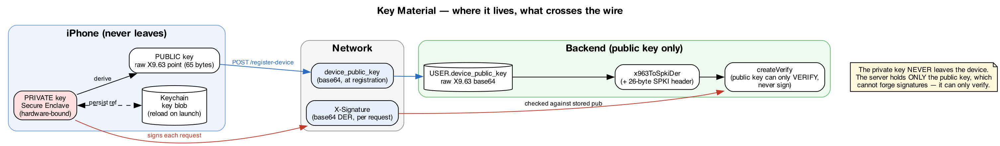
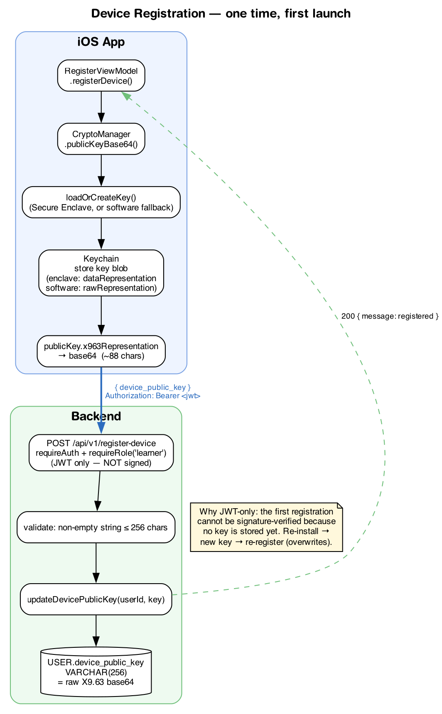
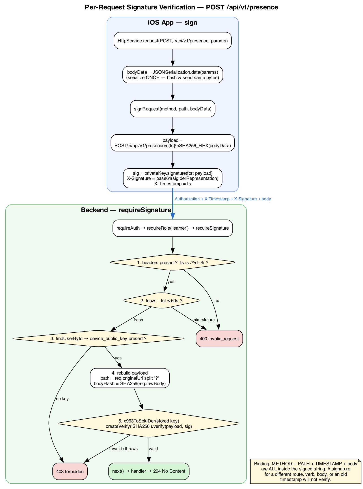

# Device Signing — How It Works End to End

This document explains, from first principles, how Aegis proves that a
`POST /api/v1/presence` request came from the specific physical iPhone that
registered — not just from someone holding a valid login token.

It ties together the three moving parts:

- **Registration** (once): the device tells the server its public key.
- **Signing** (every protected request): the device proves possession of the
  matching private key.
- **Verification** (server side): the server checks that proof.

For the wire-level spec see [`device-signing.md`](device-signing.md); for the
iOS code see [`device-signing-ios.md`](device-signing-ios.md). This document is
the conceptual glue.

---

## The core idea in one paragraph

The iPhone generates an **asymmetric key pair**. The **private key** stays on
the device forever (ideally inside the Secure Enclave hardware and never
extractable). The **public key** is sent to the server once. From then on, the
device signs each protected request with its private key, and the server
verifies the signature with the stored public key. A public key can only
*verify* signatures — it can never *create* them — so even a full database leak
does not let an attacker forge a request. Possession of the private key (i.e.
the physical device) is the thing being proven.

The signature does not cover "some data" loosely — it covers a precise
**canonical string** built from the HTTP method, path, a timestamp, and a hash
of the body. That binds the signature to *this exact request*, so it cannot be
replayed against a different endpoint, verb, or payload, nor reused after 60
seconds.

---

## Where the key material lives



| | Private key | Public key |
|---|---|---|
| Lives on | The iPhone only (Secure Enclave when available) | Sent to and stored by the server |
| Can it sign? | Yes | **No** |
| Can it verify? | — | Yes |
| Crosses the network? | **Never** | Once, at registration (base64) |
| Stored as | Keychain blob, reloaded on launch | `USER.device_public_key VARCHAR(256)` |

The public key travels as a **raw X9.63 uncompressed point** (65 bytes:
`0x04 || X || Y`), base64-encoded (~88 chars). Node's `crypto` needs an
SPKI-DER key to verify, so the server wraps the raw point by prepending a fixed
26-byte P-256 header (`x963ToSpkiDer`) before verifying. This keeps the iOS
export trivial and the server verification standard.

---

## Part 1 — Registration (one time, first launch)



**Client** (`RegisterViewModel.registerDevice()` → `CryptoManager`):

1. `loadOrCreateKey()` generates a P-256 key pair on first use — in the Secure
   Enclave if available, otherwise a software key (simulator/dev fallback).
2. The key is persisted in the Keychain so it survives restarts. Enclave keys
   store an opaque `dataRepresentation` (an encrypted, hardware-bound
   reference); software keys store the 32-byte `rawRepresentation` scalar.
3. `publicKeyBase64()` exports `publicKey.x963Representation` as base64.
4. `POST /api/v1/register-device` with `{ "device_public_key": <base64> }` and
   the usual `Authorization: Bearer <jwt>`.

**Server** (`registerDevice.ts`):

1. `requireAuth` + `requireRole('learner')` — **JWT only, no signature check.**
2. Validate the key is a non-empty string ≤ 256 chars.
3. `updateDevicePublicKey(userId, key)` stores it on the `USER` row.

### Why registration is NOT signature-verified

The first registration is a chicken-and-egg case: the server has no key yet, so
it cannot verify a signature. Registration therefore relies on the JWT alone.
If the app is reinstalled, a new key pair is generated and re-registered — the
new key overwrites the old one. (One key per user × device.)

---

## Part 2 — Signing + Verification (every protected request)



### The canonical payload

Both sides independently build the exact same string and it is what gets signed:

```
{METHOD}\n{PATH}\n{UNIX_TIMESTAMP_SECONDS}\n{SHA256_HEX(body)}
```

Example — `POST /api/v1/presence` at `1720300000` with body `{"room_id":3}`:

```
POST\n/api/v1/presence\n1720300000\n7908b1690837f426aa17e210db69e2e5871630968643d69854db097f1a16d402
```

Every field is meaningful:

| Field | Binds the signature to… | Attack it prevents |
|---|---|---|
| `METHOD` | the HTTP verb | reusing a GET signature on a POST |
| `PATH` | the exact route | replaying a `/presence` signature on another endpoint |
| `TIMESTAMP` | a 60-second window | replaying an old captured request |
| `SHA256_HEX(body)` | the exact request body | tampering with the payload after signing |

### Client — signing (`HttpService.request` → `CryptoManager.signRequest`)

1. Serialize the body **once** into `bodyData` and use those exact bytes both to
   hash and to send. (Serializing twice risks byte differences → hash mismatch →
   403. This is the single most common integration bug.)
2. Build the canonical payload with the current Unix timestamp.
3. Sign it with the private key; attach `X-Timestamp` and
   `X-Signature: base64(DER signature)`.
4. Only requests to protected routes are signed (allowlist:
   `/api/v1/presence`).

### Server — verification (`requireSignature` middleware)

Runs **after** `requireAuth` and `requireRole('learner')`, **before** the rate
limiter (so forged requests don't consume rate-limit budget):

1. **Headers + format** — `X-Timestamp` and `X-Signature` must both be present;
   the timestamp must be a strict non-negative integer (`/^\d+$/`).
   → else **400 invalid_request**
2. **Freshness** — `|now − timestamp| ≤ 60s`.
   → else **400 invalid_request**
3. **Key lookup** — `findUserById`; the user must have a `device_public_key`.
   → else **403 forbidden** (`No device registered`)
4. **Rebuild payload** — reconstruct the canonical string. **The path comes from
   `req.originalUrl` with the query string stripped**, *not* `req.path` (which is
   `/` inside a mounted router and would never match what the client signed).
   The body hash is computed over `req.rawBody`, the exact bytes received
   (captured by an `express.json({ verify })` hook).
5. **Verify** — wrap the stored raw X9.63 point into SPKI DER (`x963ToSpkiDer`)
   and run `createVerify('SHA256').verify(payload, signature)`. A bad signature
   returns `false`; a corrupt/off-curve stored key throws — both are handled as
   **403 forbidden**, never a 500.

If all five pass, `next()` runs the presence handler → **204 No Content**.

---

## Error reference

| Condition | HTTP | Code |
|---|---|---|
| Missing `X-Timestamp`/`X-Signature`, or non-integer timestamp | 400 | `invalid_request` |
| Timestamp outside ±60 s window | 400 | `invalid_request` |
| No public key registered for the user | 403 | `forbidden` |
| Signature does not verify (or stored key is malformed) | 403 | `forbidden` |
| Everything valid | 204 | — |

---

## Security properties & limits

**Guaranteed**
- **Device binding:** a request is accepted only if signed by the private key
  whose public half is stored for that user. The private key never leaves the
  device, so a stolen JWT alone is not enough to post presence.
- **Request integrity:** method, path, and body are all covered by the
  signature; altering any of them invalidates it.
- **Public-key exposure is safe:** the server (and its database) hold only the
  public key, which cannot forge signatures.

**Accepted limits (by design)**
- **Replay within ±60 s:** there is no nonce cache, so an intercepted request
  can be replayed for up to 60 seconds. Per-user presence rate limiting bounds
  the abuse. (Adding a nonce store is a possible future hardening.)
- **`register-device` is JWT-only:** the first registration can't be
  signature-verified. Anyone with a valid JWT can (re)register a device key —
  this is the trust root of the scheme.
- **Scope:** only `POST /api/v1/presence` is signature-protected today. All
  other routes remain JWT-(and role-)only.

---

## What is protected right now

| Route | Auth |
|---|---|
| `POST /api/v1/presence` | JWT + learner role + **device signature** |
| `POST /api/v1/register-device` | JWT + learner role (no signature — by design) |
| `GET /api/v1/me`, `/dashboard`, `/histories`, `/beacons` | JWT + role |
| `POST /auth/*` (login/refresh/logout) | none / rate-limit |
| `/api/v1/admin/*` | JWT + admin role |

Extending signature protection to another route is a one-line middleware
addition (`requireSignature` after `requireRole`), provided the client signs
that route's method + path.

---

## Verification status (as of this writing)

- **Proven:** the crypto and client↔server protocol. A real Swift-generated
  signature verifies through the shipped server code; tampered body / wrong
  method / wrong path / stale timestamp are all rejected. The full iOS source
  type-checks against the real CryptoKit SDK. Backend: 232 tests pass.
- **Not yet confirmed:** a full on-device run (Secure Enclave path + app build
  need Xcode on a real iPhone), and there is **no UI action that calls
  `sendPresence` yet** — the capability exists but nothing triggers it. To
  confirm end to end: build on device → register → trigger a presence send →
  expect 204.
