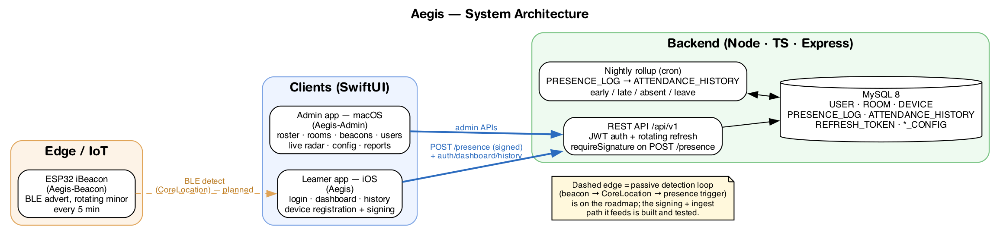

# Aegis — Product Overview

A one-page recap of what Aegis is, who it serves, what exists today, and where
it goes next. For requirements see the [PRD](product-requirements.md); for
technical detail see the [Architecture](architecture.md).

---

## The problem

A physical academy needs to record when learners are present in class. Manual
roll-call is slow, gameable, and doesn't scale across rooms and sessions. Aegis
makes attendance **passive**: a learner simply walks past a classroom, and the
system records their check-in / check-out automatically, surfacing it to admins
in real time and as a daily history.

## The users

- **Learner** — an iPhone owner enrolled in the academy. Wants attendance to
  "just happen" and to see their own history and today's status.
- **Admin / instructor** — uses a macOS app to see who is present now (live
  radar per room), the roster with today's status, and daily attendance; and to
  manage rooms, beacons, users, and session time windows.

## How it works (intended end-to-end flow)

1. **Beacons** — ESP32 boards in each room advertise as iBeacons (rotating the
   minor value every 5 minutes to resist trivial replication).
2. **Detection** — the learner's iPhone detects nearby beacons via CoreLocation
   and maps the beacon to a room.
3. **Report** — the phone sends `POST /api/v1/presence { room_id, … }`, signed
   with a hardware-backed device key so the backend can trust the report came
   from the registered physical device.
4. **Record** — the backend stores each ping and computes live status; a nightly
   rollup collapses the day into one attendance record per learner
   (`early` / `late` / `absent` / `leave`).
5. **Observe** — the admin app shows live occupancy and daily attendance; the
   learner app shows the individual's dashboard and history.

## Key product decisions

- **Passive over active.** Attendance is inferred from proximity, not a button
  press — the whole value proposition. (See the [tech report](tech-report-v0.md).)
- **Edge-first positioning.** Fine-grained location (X/Y via trilateration
  across multiple beacons) is computed on the phone, not the server.
- **Hardware-backed trust.** Because iBeacon advertisements are themselves
  unauthenticated (anyone can rebroadcast a major/minor pair), Aegis binds each
  presence report to a **registered device key** (P-256, Secure Enclave) via
  request signing. This raises the bar from "anyone with a token" to "the
  physical enrolled device." See [device signing](device-signing-end-to-end.md).
- **Plain JWT, not OAuth/PKCE.** An earlier plan for OAuth2 + PKCE was dropped
  in favour of plain JWT (HS256 access + rotating opaque refresh) — simpler, with
  no security property lost for a first-party client set.

## What's built today

| Capability | State |
|---|---|
| Backend REST API (auth, learner, admin) | ✅ Built, 24 test files |
| JWT auth + rotating refresh + reuse detection | ✅ Built |
| Presence ingestion + live status | ✅ Built |
| Nightly attendance rollup (early/late/absent/leave) | ✅ Built |
| Session windows + system config (timezone, staleness) | ✅ Built |
| Device signing on `POST /presence` | ✅ Built & verified |
| Admin macOS app (roster, rooms, beacons, users, radar, config, reports) | ✅ Built |
| Beacon firmware (iBeacon advertiser, rotating minor) | ✅ Built |
| Learner app: login, dashboard, history | ✅ Built |
| Learner app: device registration + request signing | ✅ Wired |
| Signing test tool (browser) | ✅ Built |

## Roadmap / next steps

The signing-and-ingest half of the presence path is built and verified; the
sensing half on the learner phone is the main remaining work to close the
passive-attendance loop end to end:

1. **Beacon detection on the learner app.** Add CoreLocation region monitoring /
   ranging (`CLLocationManager`, `CLBeacon`) — currently not yet in the iOS app.
   This is the trigger that will call the already-wired `sendPresence(...)`.
2. **Trilateration / positioning.** Compute room-level X/Y from multiple beacons
   (non-linear least squares) on-device, to feed `position_x` / `position_y`.
3. **Registration entry point.** Surface the device-registration screen in the
   normal launch flow (the signing capability is wired; it needs a reachable UI).
4. **Backend hardening ops.** Add CI (lint/type-check/test on PRs) and a
   container/compose story for reproducible deploys.
5. **Optional signing hardening.** Replay-nonce cache beyond the ±60 s window;
   extend `requireSignature` to other sensitive learner routes if needed.

## Known limitations (accepted for now)

- **iBeacon advertisements are unauthenticated.** A beacon's major/minor is
  public and can be rebroadcast. Device signing proves the *phone* is enrolled,
  but not that the phone was *physically* near the beacon (a modified client
  could send fabricated `room_id`s). Full spoof-resistance would require custom
  BLE firmware with rotating secrets or a physical checkpoint reader. Documented
  as a v1 limitation in the [tech report](tech-report-v0.md).
- **Replay within 60 s.** The signing timestamp window allows replay for up to
  a minute; per-user rate limiting bounds abuse.
- **English only, no localization** for the MVP (internal tool).
