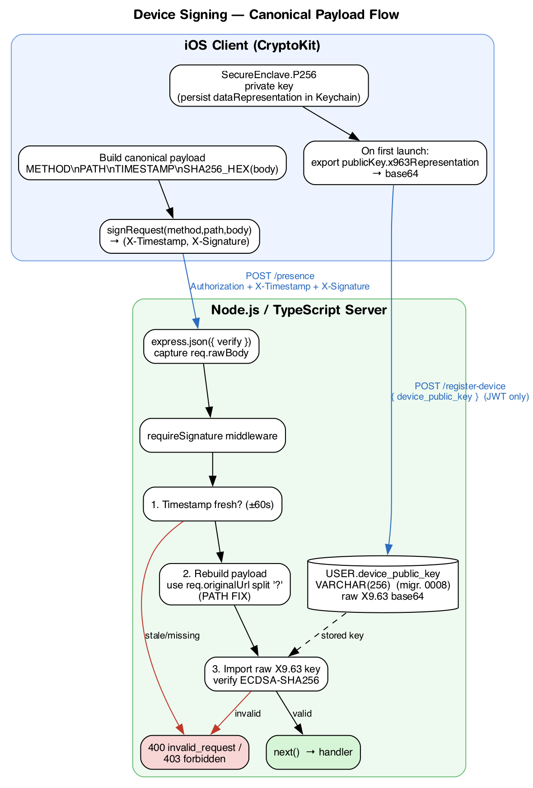
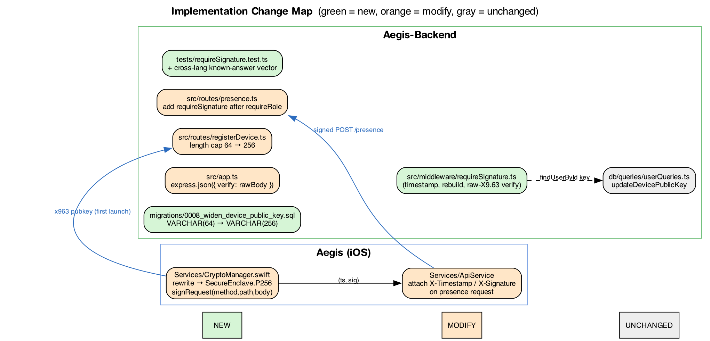

# Device Signing Reconciliation — Design Spec

**Date:** 2026-07-08
**Status:** Approved for planning

## Problem

`docs/device-signing.md` describes a P-256 ECDSA request-signing scheme, and
some pieces already exist in the repo — but the existing client, server, and
schema diverge from the doc and from each other in ways that would fail at
runtime. This spec reconciles those divergences into one coherent, working
design and lists the remaining pieces to build.

## Goal

A learner's `POST /api/v1/presence` request is cryptographically bound to the
physical device that registered, on top of the existing JWT auth. The server
rejects any presence request whose signature does not verify against the
device public key stored for that user.

## Signing Scheme (decided)

**Canonical-payload signing**, per `docs/device-signing.md`. No server-issued
challenge, no extra round-trip. For every protected request the client signs:

```
{METHOD}\n{PATH}\n{UNIX_TIMESTAMP_SECONDS}\n{SHA256_HEX(body)}
```

and sends `X-Timestamp` + `X-Signature` alongside the usual `Authorization`
header. The server rebuilds the identical string and verifies.

## Current State vs. Target

| Piece | Current | Target |
|---|---|---|
| Signing scheme (iOS) — *deferred* | `sign(serverChallenge:)` — signs an arbitrary string | `signRequest(method:path:body:)` — signs the canonical payload (follow-up PR) |
| iOS crypto API — *deferred* | Security framework (`SecKeyCreateRandomKey`) | CryptoKit (`SecureEnclave.P256.Signing.PrivateKey`) (follow-up PR) |
| Public key format | raw X9.63 (`SecKeyCopyExternalRepresentation`) | **raw X9.63** (unchanged decision) — `publicKey.x963Representation` |
| Server key import | `type: 'spki'` (expects SPKI DER) | wrap raw X9.63 point into SPKI DER, then verify |
| `USER.device_public_key` | `VARCHAR(64)` (migration 0007) | `VARCHAR(256)` (new migration 0008) |
| `registerDevice` length cap | `> 64` | `> 256` |
| `requireSignature` middleware | missing | new file |
| `rawBody` capture in `app.ts` | missing | `express.json({ verify })` |
| Signature check on `/presence` | not applied | applied after `requireRole` |

## Decisions

1. **Scheme:** canonical payload (not server challenge).
2. **Key format:** raw X9.63 uncompressed point, base64. The server wraps it
   into SPKI DER by prepending the fixed 26-byte P-256 SPKI header
   (`3059301306072a8648ce3d020106082a8648ce3d030107034200`) before verifying
   with Node's `crypto.createVerify` + `type: 'spki'`. This keeps the iOS
   export trivial (`x963Representation`) and the server verify path standard.
3. **iOS crypto:** CryptoKit `SecureEnclave.P256`. Private key
   `dataRepresentation` persisted in the Keychain and reloaded on launch.
4. **Column width:** `VARCHAR(256)` (a base64 raw X9.63 P-256 key is ~88 chars;
   256 leaves headroom and matches the doc).

## Bug Fixes Folded In

- **Path mismatch:** routes mount at `/api/v1/presence` and the handler is
  `router.post('/')`, so inside the router `req.path` is `/`. The client signs
  the full path. `requireSignature` MUST rebuild the path from
  `req.originalUrl` with the query string stripped (`split('?')[0]`), not
  `req.path`. Without this, every signature fails to verify.
- **Doc example body shape:** the doc's worked example uses `{"beacon_id":3}`,
  but the presence body is `{ room_id, ... }`. Update the doc example to the
  real body shape to avoid confusion.

## Architecture

### Signing flow



### Implementation change map



## Components

### Server — `src/middleware/requireSignature.ts` (new)

`RequestHandler`, runs after `requireAuth` (and `requireRole`). Steps:

1. Guard `req.user` is set; else `AppError('unauthorized')`.
2. Read `x-timestamp` / `x-signature` headers; both must be strings, else
   `AppError('invalid_request')`.
3. Parse timestamp as int; reject `NaN`. Reject if
   `Math.abs(Date.now() - timestamp*1000) > 60_000` → `invalid_request`.
4. `findUserById(req.user.id)`; if no `device_public_key` →
   `AppError('forbidden', 'No device registered for this account')`.
5. Rebuild payload:
   `${req.method}\n${req.originalUrl.split('?')[0]}\n${timestamp}\n${bodyHashHex}`
   where `bodyHashHex = sha256(req.rawBody ?? Buffer.alloc(0))`.
6. Wrap the stored base64 raw X9.63 point into SPKI DER (prepend header),
   `createVerify('SHA256').update(payload).verify({ key, format:'der',
   type:'spki', dsaEncoding:'der' }, signatureDer)`. Invalid →
   `AppError('forbidden', 'Invalid device signature')`.

Exposes a small helper `x963ToSpkiDer(raw: Buffer): Buffer` (unit-testable).

### Server — `src/app.ts` (modify)

`express.json({ limit: '64kb', verify: (req, _res, buf) => { (req as any).rawBody = buf; } })`.

### Server — migration `0008_widen_device_public_key.sql` (new)

`ALTER TABLE USER MODIFY COLUMN device_public_key VARCHAR(256) NULL DEFAULT NULL;`

### Server — `src/routes/registerDevice.ts` (modify)

Length cap `> 64` → `> 256`; message updated.

### Server — `src/routes/presence.ts` (modify)

Insert `requireSignature` after `requireRole('learner')`, before
`presenceRateLimit`.

### Client — iOS (DEFERRED to a follow-up PR)

The iOS signing client is **out of scope for this PR**. The app has no presence
request today (no `sendPresence`, no presence code anywhere in
`Aegis/Aegis/**/*.swift`), and `HttpService` is a single generic `request()`.
Building the signing client now would sign a request that does not exist and
would churn `CryptoManager` (breaking `RegisterViewModel`) for no runtime
benefit. The backend enforces signatures regardless of client readiness.

The follow-up PR will: rewrite `CryptoManager` to CryptoKit
(`publicKeyBase64()` via `x963Representation`, `signRequest(method:path:body:)`),
update `RegisterViewModel` to the new API and actually call `registerDevice`,
add a `sendPresence` request, and inject `X-Timestamp`/`X-Signature` headers in
`HttpService.request()`. The cross-language vector below is the target it must
match.

## Error Responses

| Condition | HTTP | Code |
|---|---|---|
| Missing `X-Timestamp` / `X-Signature` | 400 | `invalid_request` |
| Timestamp non-integer or outside ±60 s | 400 | `invalid_request` |
| No public key registered for user | 403 | `forbidden` |
| Signature does not verify | 403 | `forbidden` |

## Testing

- **`x963ToSpkiDer`**: known-answer — a fixed raw point wraps to the expected
  SPKI DER bytes.
- **`requireSignature`** (mock `findUserById`): generate a P-256 key pair in
  the test, sign a canonical payload, assert:
  - valid signature → `next()` with no error
  - stale timestamp → `invalid_request`
  - missing headers → `invalid_request`
  - non-integer timestamp → `invalid_request`
  - user has no key → `forbidden`
  - tampered body / wrong signature → `forbidden`
  - path rebuilt from `originalUrl` (mount-prefixed request verifies)
- **`presence.test.ts`** (existing): update `buildTestApp` to include the
  `rawBody` verify hook and a signed request helper so existing cases pass with
  the middleware in place; add one unsigned-request case (missing headers →
  **400 `invalid_request`**) and one no-key-registered case (→ 403 `forbidden`).
- **Cross-language vector:** a fixed (privateKey, payload) → signature vector
  documented so the iOS side can be checked against the server.

## Out of Scope (YAGNI)

- Signature verification on `register-device` (stays JWT-only, per doc note).
- Key rotation / multiple devices per user.
- Replay protection beyond the ±60 s timestamp window (no nonce cache).
- Applying `requireSignature` to routes other than `/presence`.
